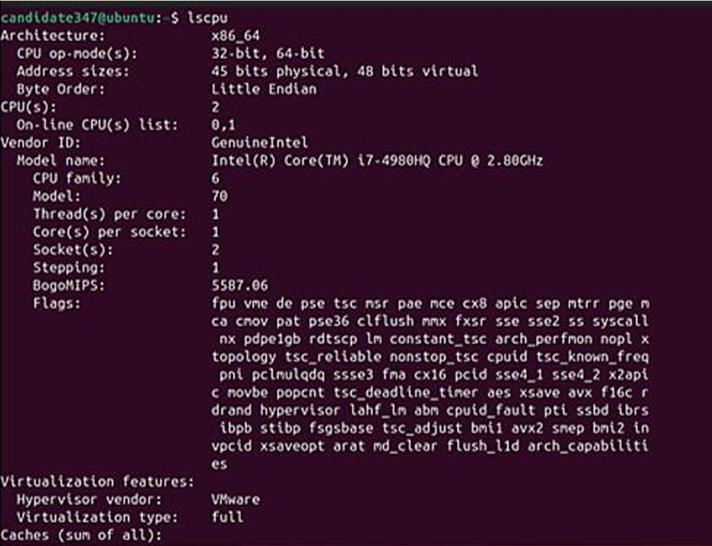
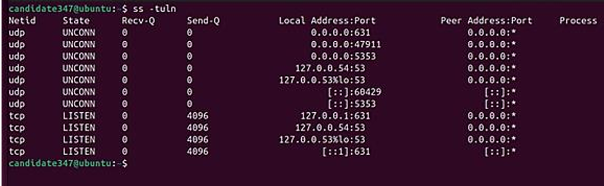
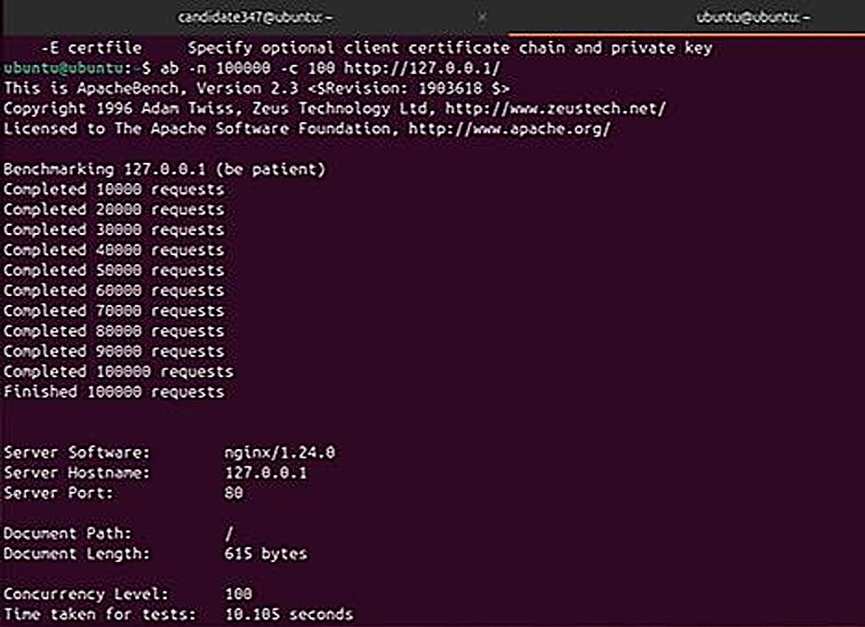
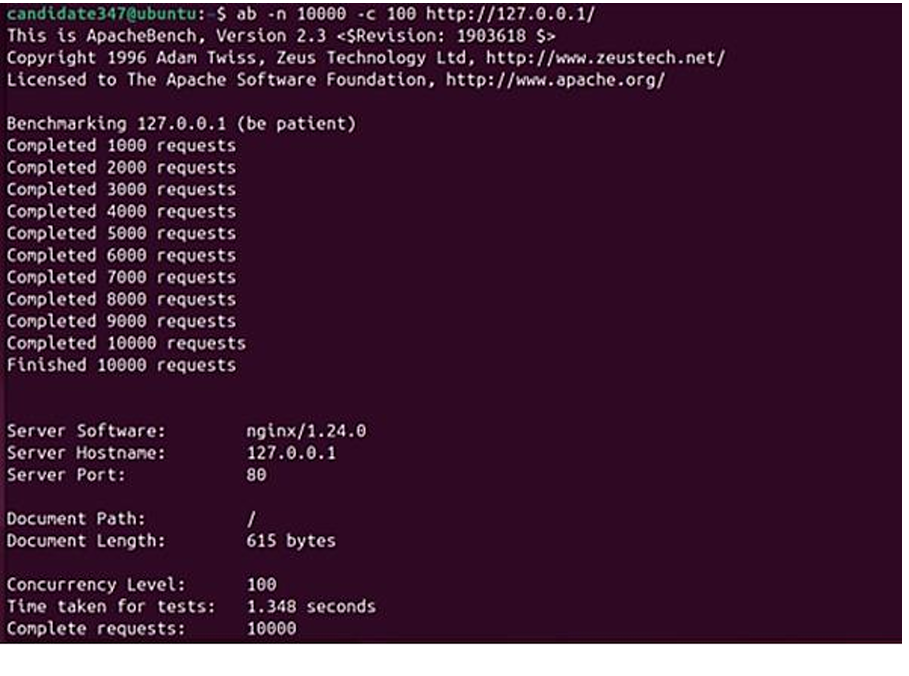
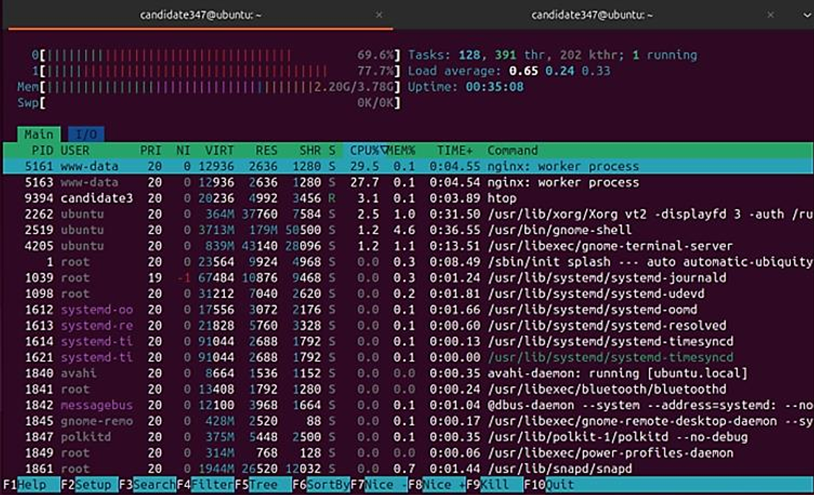
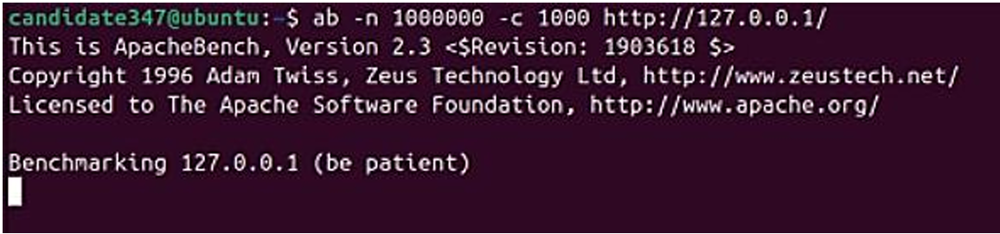
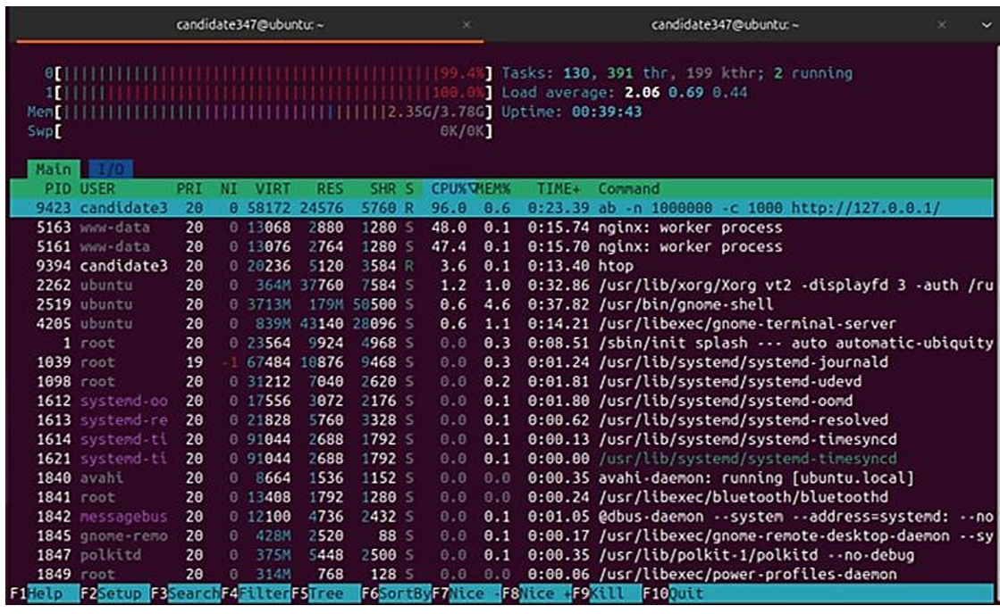
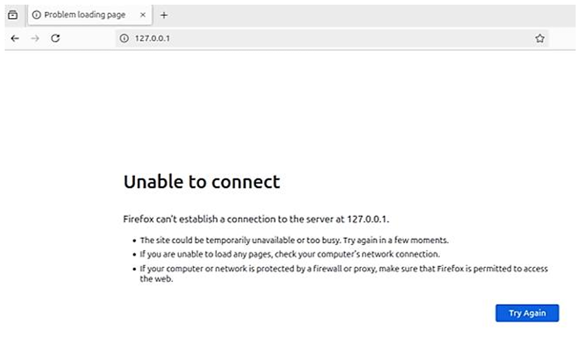

# Cloud Security Operations Lab
This project focuses on understanding hybrid cloud environments, compliance standards, and cloud security testing.
It combines research, planning, and technical experimentation using Azure, Nginx, Docker, and Apache Benchmark.

## Table of Contents

* [Content](#content)
* [Key Learnings](#key-learnings)
* [Tools and Technologies](#tools-and-technologies)
* [Goal](#goal)
* [Project Screenshots](#project-screenshots)

  * [Virtual Machine Setup](#virtual-machine-setup)
  * [CPU Info (lscpu)](#cpu-info-lscpu)
  * [Open Ports Check](#open-ports-check)
  * [ApacheBench DDoS Simulation](#apachebench-ddos-simulation)
  * [ApacheBench DDoS Simulation in Docker](#apachebench-ddos-simulation-in-docker)
  * [System Resource Usage During DDoS Simulation](#system-resource-usage-during-ddos-simulation)
  * [ApacheBench DDoS Stress Test (1,000,000 Requests)](#apachebench-ddos-stress-test-1000000-requests)
* [Conclusion & Future Work](#conclusion--future-work)
* [Further Reading](#further-reading)

---

## Content

* Hybrid cloud architecture design and analysis
* Security and compliance research (GDPR, NIS Directive, U.S. Data Protection laws)
* Security framework planning using **NIST Cybersecurity Framework (CSF)**
* Practical exercises: DDoS simulation, containerized deployments, and performance analysis

---

## Key Learnings

* Designing **hybrid cloud architectures** with a focus on scalability, compliance, and resilience
* Configuring and testing **Nginx** web servers under simulated high-traffic conditions
* Using **Docker** to isolate workloads and measure container performance
* Conducting **load and stress testing** using Apache Benchmark (`ab`)
* Applying **incident response** and **business continuity planning** principles
* Leveraging **Azure governance and monitoring tools** for secure cloud management

---

## Tools and Technologies

* **Microsoft Azure** – for cloud resource deployment and management
* **Nginx** – lightweight web server for performance testing
* **Docker** – containerization for service isolation
* **Apache Benchmark (ab)** – HTTP benchmarking tool for DDoS simulation and performance analysis
* **Ubuntu Virtual Machine** – base environment for configuration and testing
* **NIST CSF** and **CSA Cloud Security Guidelines** – compliance frameworks

---

## Goal

To gain practical and theoretical understanding of **cloud security design**, **governance**, and **performance testing** through a hybrid cloud simulation setup.

---

## Project Screenshots

### Virtual Machine Setup

An **Ubuntu VM** was created in VMware Workstation and verified using the `whoami` command to confirm the environment identity.
This ensures reproducibility and authenticity of the experiment setup.


---

### CPU Info (lscpu)

The `lscpu` command was used to document the VM’s hardware specifications, including CPU count, cores per socket, and bogomips value.

**Number of CPUs/Cores:** 2  **BogoMIPS per core:** 5587.06



---

### Open Ports Check

To inspect open network ports and listening services, the command below was executed:

```bash
ss -tuln
```

The system showed active ports including **port 631** (for IPP printing service).
It was listening on:

* `0.0.0.0:631` (IPv4)
* `127.0.0.1:631` (loopback)
* `[::1]:631` (IPv6)

This confirmed that the VM was accepting incoming connections on multiple network interfaces.



---

### ApacheBench DDoS Simulation

The first DDoS simulation used **Apache Benchmark (ab)** to stress-test the locally running Nginx server.

**Setup commands:**

```bash
sudo apt update && sudo apt install nginx apache2-utils -y
sudo systemctl start nginx
ab -n 100000 -c 100 127.0.0.1/
```

This command generated **100,000 requests** with **100 concurrent connections**.
System performance and CPU utilization were observed using the `htop` command.



---

### ApacheBench DDoS Simulation in Docker

To evaluate the same test inside a containerized environment, an Nginx instance was deployed in Docker:

```bash
sudo docker run -d -p 80:80 --name nginx-container nginx
```

The same Apache Benchmark test was run inside Docker:

```bash
ab -n 10000 -c 100 127.0.0.1/
```

**Observation:**
Docker added minimal overhead, but overall performance remained consistent with the native VM setup.



---

### System Resource Usage During DDoS Simulation

System metrics such as **CPU load**, **memory usage**, and **active processes** were monitored with `htop`.

**Findings:**

* **CPU load** increased significantly during both tests.
* **Docker** introduced a small amount of overhead.
* The containerized Nginx used slightly more memory but remained stable.



---

### ApacheBench DDoS Stress Test (1,000,000 Requests)

To measure system limits, a large-scale stress test was conducted with 1,000,000 requests and 1,000 concurrent threads:

```bash
ab -n 1000000 -c 1000 http://127.0.0.1/
```

During this test:

* **CPU utilization reached nearly 100%.**
* **Memory usage spiked sharply.**
* The system eventually became **unresponsive**, simulating a successful denial of service.





---

## Conclusion & Future Work

These experiments validated the performance impact of simulated DDoS attacks on Nginx servers, both natively and in Docker containers.
While containerization introduces a slight performance overhead, it also enhances process isolation and control under high load conditions.

### Key Takeaways

* Continuous monitoring of **CPU and memory utilization** is essential under high load
* **Rate limiting**, **load balancing**, and **WAFs** help prevent service outages
* **Capacity planning** must account for extreme traffic spikes
* Docker provides flexibility but should be optimized for performance

### Future Work

* Automate stress testing through **CI/CD pipelines**
* Explore **horizontal scaling** using multiple containers or VMs
* Implement **load balancers** and **caching** mechanisms for high availability
* Analyze additional metrics such as **network I/O**, **latency**, and **disk I/O**

---

## Further Reading

* [Hybrid Cloud Strategy Case Study](./HYBRID_CLOUD_STRATEGY.md)

---

*Project by **Samithran Ramesh** — Cloud Security Operations Lab*

---

